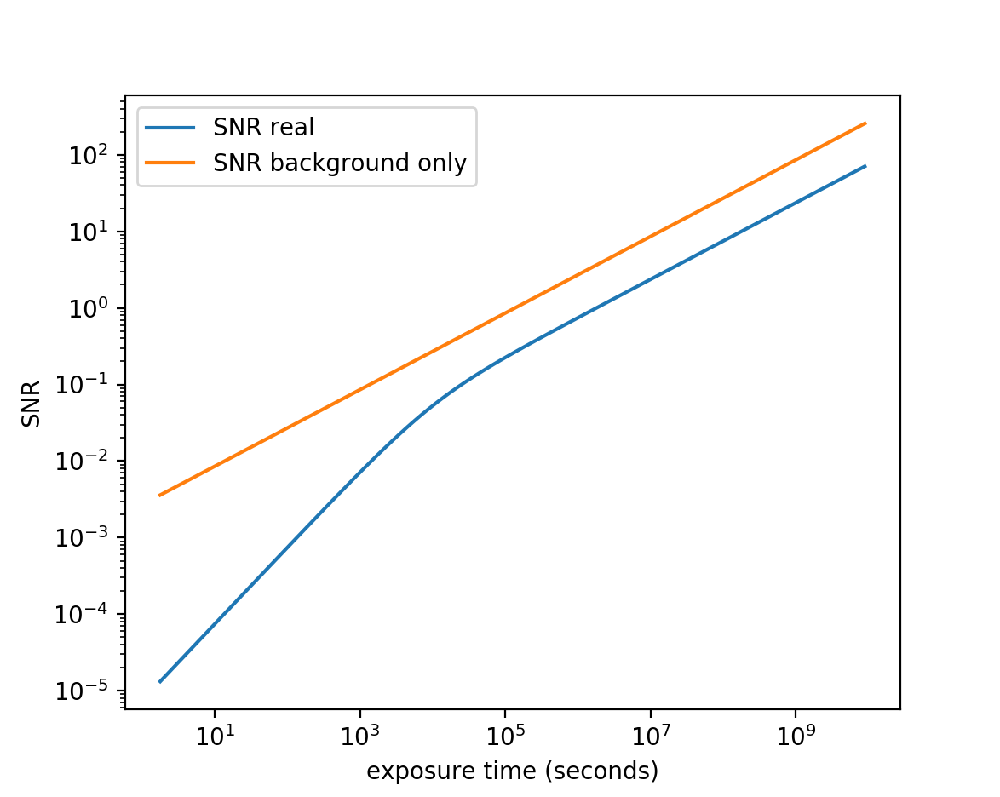
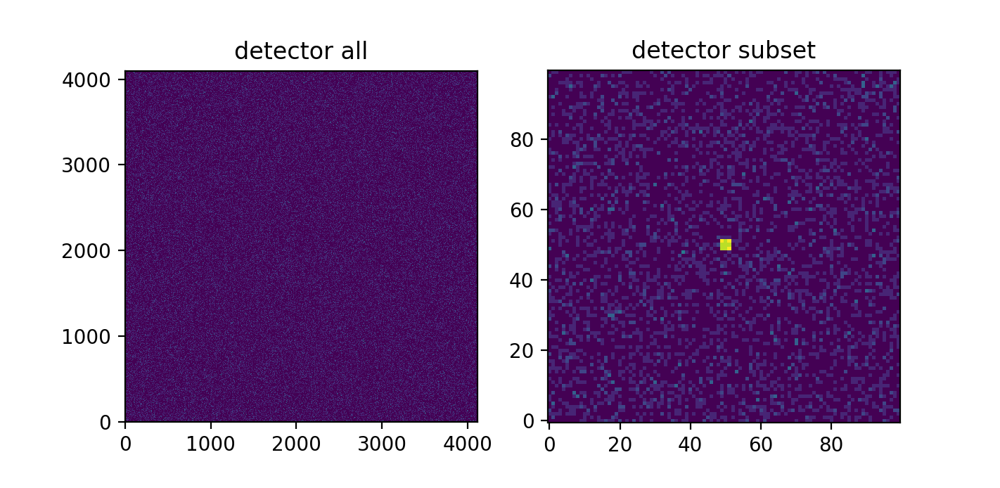
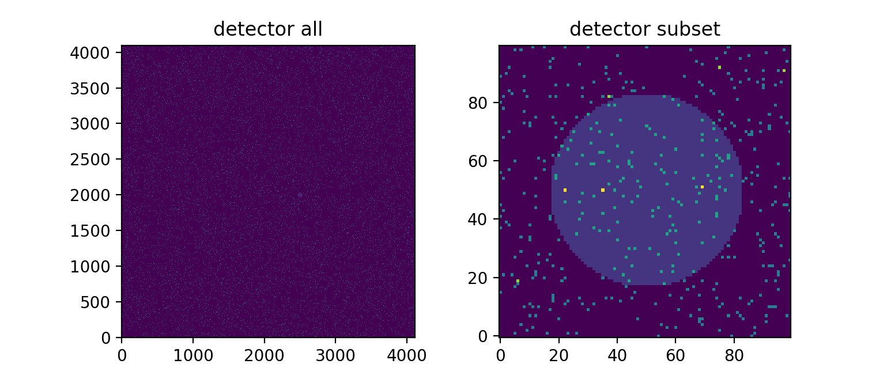

I wrote this code with python3 in mind. To test out these answers, you will need to go into the file etc.py to make changes. etc.py is where I do all my calculations for this homework.

## Assignment 1

### 1) For a 10-minute exposure, how many total photons are collected in the g-band from a G2V star of g-magnitude 12, 18 and 26?

using the SDSS settings

magnitude, photons

12,       19508.57 

18,       77.67

26,       0.05

### 2) In all three cases, for that same 10-minute exposure what is the number of counts in pixel that is completly inside the disk "psf"?  Is this pixel saturated?

magnitude, total photons within the seeing disk

12,      19597.40

18,      166.50

26,      88.88

The seeing disk takes up about 9 pixels. In all cases the seeing disk is not saturated. 

### 3) How many counts from the sky are collected in that 10-minute exposure in the same aperture in the g-band?

sky counts per pixel in the SDSS image scale: 0.37055013857504265

### 4)  What is the signal to noise for all three observations from parts 1-3?  You should include readnoise and dark current as well as the sky.

magnitude, SNR using the signal to noise equation

12,      139.36

18,      6.02

26,      0.01

magnitude, SNR attempting aperture photometry (photutils)

12,      9142.52

18,      22.18

26,      0.81

### 5) Suppose instead you system had the same focal plane scale as Keck: 0.727 mm/arcecond.  What is the signal to noise for each obesrvation in a 10 minute exposure? 

using Keck image scale

magnitude, SNR using the signal to noise equation

12,      531.71

18,      39.04

26,      0.004

magnitude, SNR attempting aperture photometry (photutils)

12,      2152.46

18,      58.47

26,      0.90

### 6) Still with the same Keck focal plane scale, how long would you have to integrate to be sky-noise limited at 26th magnitude? 

In the following figure, the SNR of the 26th mag star is plotted vs. exposure time in blue. The SNR of the star only accounting for sky noise is plotted in orange. The two lines are in the same regime when they run parallel. There is a vertical offset in SNR because the read noise and dark current. At an exposure time of 10^4 seconds or ~3 hours you are sky noise limited. 

### Images

#### SDSS

#### Keck

